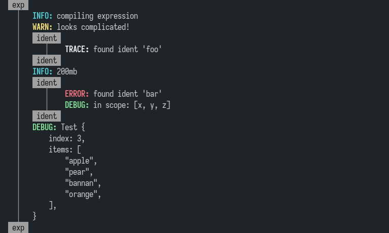

# Malogany

<p align="center">
<br>
<b>Simple tree/hierarchical logging library</b><br>
<i>(Tree > Mahogany) + Logging => Malogany</i>
</p>

## Usage

Add the following to your `Cargo.toml`

```toml
[dependencies]
log = "0.4"
malogany = "0.1"
```

Initalize Malogany with the max log level

```rust
malogany::init(Level::Trace).unwrap();
```

For normal messages, use the `info!`, `warn!`, `error!` and `debug!` macros from the `log` crate. To create a branch, use `enter_branch` and `exit_branch`:

```rust
malogany::enter_branch("ident");

// any log messages will be nested within the ident branch
// you can keep nesting with `enter_branch`/`exit_branch`

malogany::exit_branch();
```

Branches are only rendered in debug builds for performance reasons. Future versions of this crate will make this customizable.

In version `0.2` you can use [`scopeguard`](https://github.com/bluss/scopeguard) to automatically exit the branch when the guard returned by `enter_branch_scoped` falls out of scope. To enable this feature, add the following to your `Cargo.toml`:

```toml
malogany = { version = "0.1" , features = ["scopeguard"] }
```

Then use `malogany::enter_branch_scoped` instead of `malogany::enter_branch`. 

```rust
{
  // behaves the same as enter_branch
  let _guard = malogany::enter_branch_scoped("branch");

  // any log messages will be nested within the branch as expected

  // at the end of this block, _guard will be dropped which automatically calls `malogany::exit_branch()` 
}
```

Note that the guard variable is very important, it cannot be removed. See [`scopeguard`'s docs](https://docs.rs/scopeguard/latest/scopeguard/) for more information.

## Example

The screenshot above is the output of `example/basic.rs`. Try it for yourself with `cargo run --example basic`. For an example of using `scopeguard`, try `cargo run --all-features --example scoped`.